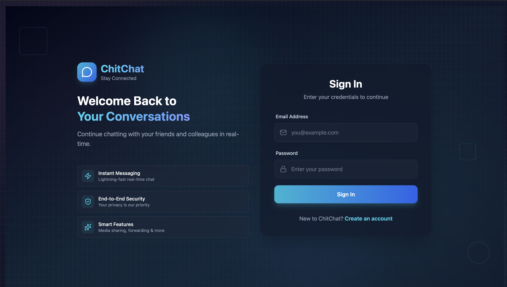
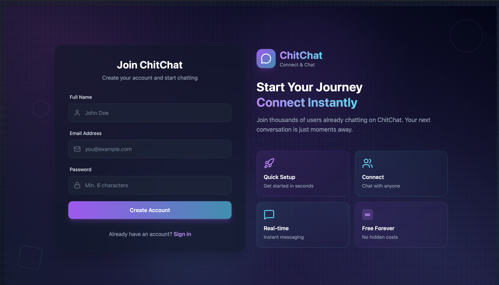
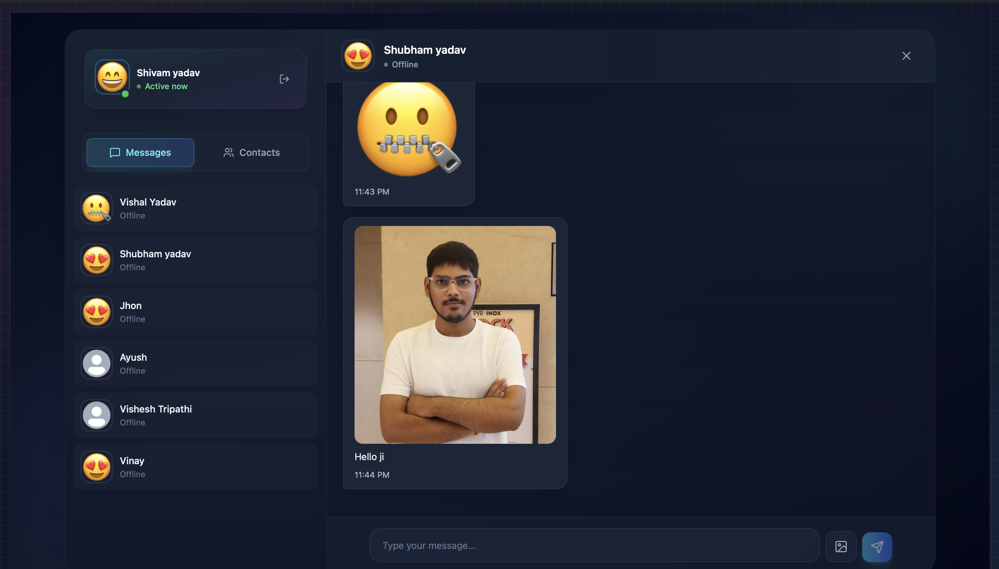
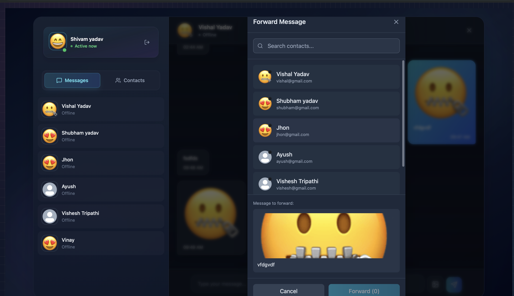

# Chit-Chat 💬

A real-time chat application built with the MERN stack, featuring Socket.io for instant messaging, Cloudinary for media management, and Arcjet for security.

## ✨ Features

- 🔐 **Authentication** - Secure user registration and login with JWT
- 💬 **Real-time Messaging** - Instant message delivery using Socket.io
- 👥 **User Management** - View active users and manage contacts
- 📎 **Media Sharing** - Send images with Cloudinary integration
- ↪️ **Message Forwarding** - Forward messages to other contacts
- 🔒 **Security** - Rate limiting and protection with Arcjet
- 🎨 **Modern UI** - Clean and responsive interface with Tailwind CSS

## 📸 Screenshots

### Login Page

*User authentication with secure login*

### Signup Page

*New user registration interface*

### Chat Page

*Real-time messaging interface with contact list*

### Forward Message UI

*Forward messages to multiple contacts*

## 🛠️ Tech Stack

### Frontend
- **React** - UI library
- **Vite** - Build tool
- **Redux** - State management
- **Socket.io Client** - Real-time communication
- **Axios** - HTTP client
- **Tailwind CSS** - Styling
- **DaisyUI** - UI component library
- **React Hot Toast** - Notifications

### Backend
- **Node.js** - Runtime environment
- **Express** - Web framework
- **MongoDB** - Database
- **Socket.io** - Real-time communication
- **Cloudinary** - Media storage
- **Arcjet** - Security and rate limiting
- **JWT** - Authentication

## 📋 Prerequisites

Before you begin, ensure you have the following installed:
- **Node.js** (v14 or higher)
- **npm** or **yarn**
- **MongoDB** (local or MongoDB Atlas account)

## 🚀 Setup Instructions

### 1. Clone the Repository

```bash
git clone <repository-url>
cd chit-chat
```

### 2. Backend Setup

```bash
# Navigate to backend directory
cd backend

# Install dependencies
npm install

# Create .env file
cp .env.example .env
```

Edit the `backend/.env` file with your configuration (see Environment Variables section below).

```bash
# Start the backend server
npm run dev
```

The backend server will start on `http://localhost:5001`

### 3. Frontend Setup

```bash
# Navigate to frontend directory (from root)
cd frontend

# Install dependencies
npm install

# Create .env file
cp .env.example .env
```

Edit the `frontend/.env` file with your configuration (see Environment Variables section below).

```bash
# Start the frontend development server
npm run dev
```

The frontend will start on `http://localhost:5173`

## 🔐 Environment Variables

### Backend (.env)

Create a `.env` file in the `backend` directory with the following variables:

```env
# Server Configuration
PORT=5001
NODE_ENV=development

# Database
MONGODB_URI=mongodb://localhost:27017/chit-chat
# Or for MongoDB Atlas:
# MONGODB_URI=mongodb+srv://<username>:<password>@cluster.mongodb.net/chit-chat

# JWT Secret
JWT_SECRET=your_super_secret_jwt_key_here_change_this_in_production

# Cloudinary Configuration
CLOUDINARY_CLOUD_NAME=your_cloudinary_cloud_name
CLOUDINARY_API_KEY=your_cloudinary_api_key
CLOUDINARY_API_SECRET=your_cloudinary_api_secret

# Arcjet Configuration
ARCJET_KEY=your_arcjet_api_key
ARCJET_ENV=development

# CORS
CLIENT_URL=http://localhost:5173
```

### Frontend (.env)

Create a `.env` file in the `frontend` directory with the following variables:

```env
# Backend API URL
VITE_BACKEND_URL=http://localhost:5001
```

## 📝 Getting API Keys

### MongoDB
1. **Local MongoDB**: Install MongoDB locally or use MongoDB Compass
2. **MongoDB Atlas** (Cloud):
   - Create account at [mongodb.com/atlas](https://www.mongodb.com/atlas)
   - Create a new cluster
   - Get your connection string from "Connect" → "Connect your application"

### Cloudinary
1. Create account at [cloudinary.com](https://cloudinary.com)
2. Go to Dashboard
3. Copy your Cloud Name, API Key, and API Secret

### Arcjet
1. Create account at [arcjet.com](https://arcjet.com)
2. Create a new project
3. Copy your API key from the dashboard

### JWT Secret
- Generate a random string for JWT_SECRET
- You can use: `node -e "console.log(require('crypto').randomBytes(64).toString('hex'))"`

## 🏃 Running the Application

### Development Mode

**Terminal 1 - Backend:**
```bash
cd backend
npm run dev
```

**Terminal 2 - Frontend:**
```bash
cd frontend
npm run dev
```

### Production Build

**Backend:**
```bash
cd backend
npm start
```

**Frontend:**
```bash
cd frontend
npm run build
npm run preview
```

## 📁 Project Structure

```
chit-chat/
├── backend/
│   ├── src/
│   │   ├── controllers/      # Route controllers
│   │   ├── lib/              # Third-party integrations
│   │   ├── middleware/       # Express middleware
│   │   ├── models/           # MongoDB models
│   │   ├── routes/           # API routes
│   │   └── server.js         # Entry point
│   └── package.json
│
└── frontend/
    ├── src/
    │   ├── components/       # React components
    │   ├── hooks/            # Custom hooks
    │   ├── lib/              # Utilities and configs
    │   ├── pages/            # Page components
    │   ├── store/            # Redux Toolkit slices and store
    │   └── App.jsx           # Main app component
    └── package.json
```

## 🔧 Available Scripts

### Backend
- `npm run dev` - Start development server with nodemon
- `npm start` - Start production server

### Frontend
- `npm run dev` - Start Vite development server
- `npm run build` - Build for production
- `npm run preview` - Preview production build
- `npm run lint` - Run ESLint

## 🤝 Contributing

1. Fork the repository
2. Create your feature branch (`git checkout -b feature/AmazingFeature`)
3. Commit your changes (`git commit -m 'Add some AmazingFeature'`)
4. Push to the branch (`git push origin feature/AmazingFeature`)
5. Open a Pull Request

